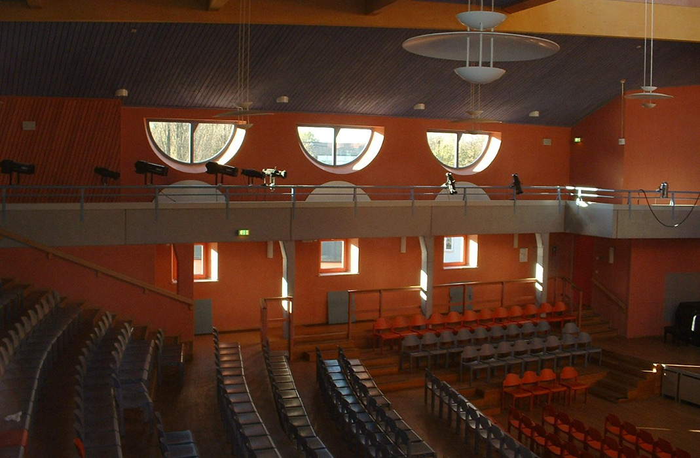
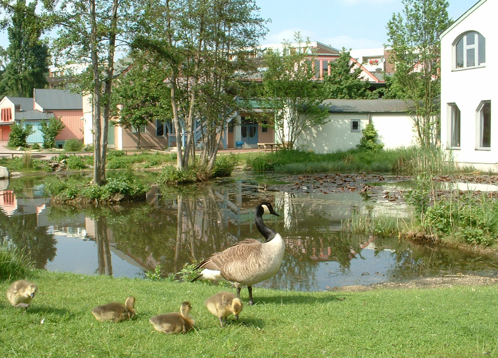

# КОРОЛЕВСТВО ДЛЯ СКАЗОК

> Датский архитектор Нильс Зонне-Фредериксен проектирует удивительные детские
сады и школы. Это не просто здания, а настоящие сказочные домики с необычными
стенами, окнами, крышами. Он строит для детей маленькие города, где есть, например, Кривая улица, Улица мастеров, Дом на озере.
_Интервью: Ольга Гладуш. Фото: предоставлены архитектором._

– Как случилось, что вы стали заниматься проектированием именно детских садов и школ?

– Несколько лет я занимался цветовым оформлением школ
и детских садов в разных городах Европы. А в 1980 году начал 
работать в архитектурном бюро датского архитектора
Эрика Асмуссена. К этому времени в компании уже было
сделано несколько проектов школ и детских садов, а также
других интересных зданий. Они были построены в Дании,
Норвегии, Швеции и Англии. Потом мы получили заказ на
строительство новой школы в Германии, и я работал над
этим проектом как архитектор. С этой страной наша компания 
только начинала сотрудничать, и мне посчастливилось стать ответственным за серию немецких проектов, в
основном школ и детских садов. Так что в течение нескольких 
лет я создавал детские учреждения.

– С чего начинается ваша работа над новым проектом?

– Начало – всегда особое событие. Это радостный момент,
когда предоставляется полная свобода действий и возможность воплотить свои замыслы. Первый этап – это встреча
с клиентом, заказчиком. Он рассказывает о своих пожеланиях, 
затем мы рассматриваем финансовые возможности.
Именно этот человек будет движущей силой проекта, он
говорит «да» или «нет» и оплачивает счета. Потом обязательно 
еду смотреть место будущей стройки. Я должен
вдохновиться пространством. Это основа будущего проекта, 
который однажды появится здесь. Изучаю рельеф
земли, качество почв, смотрю, где и как растут деревья,
потому что в разработке проекта имеет значение все. Иногда 
удается встретиться с теми, кто будет пользоваться будущим 
объектом, их пожелания также могут быть очень
полезны.

– Ваши проекты были осуществлены в Норвегии и Германии. 
Почему выбрали именно эти страны?

– Дело в том, что архитектор может лишь в некоторой степени 
выбирать, где строить. Чаще случается так, что его
выбирает заказчик и сам обращается с предложением что-то 
создать. Ты можешь согласиться или нет.

– Как складываются ваши отношения с заказчиком и клиентом?

– Чтобы описать взаимосвязь между клиентом, архитектором 
и проектом, можно привести в пример отношения
между мужчиной и женщиной, в результате которых на свет
появляется малыш. Архитектор как бы выполняет роль женщины, 
которая может родить ребенка. Он – единственный,
кто может спроектировать новый дом.

– Есть ли какие-нибудь особенности при проектировании детских садов и школ?

– Дети особым образом воспринимают окружающий мир.
Например, свои игрушки, мебель – столы и стулья – они
считают такими же живыми существами, как и людей. Так
же они воспринимают и здания. Поэтому, конечно, создавая 
детский проект необходимо все это учитывать.

– Какие материалы вы используете?

– В процессе строительства применяются только натуральные 
строительные материалы. Покрытие крыши часто делаем из травы. 
Озеленение крыш способно сотворить чудо:
количество кислорода, производимого такой экологической крышей, 
очень велико!

– Общаетесь ли вы с детьми, когда работаете над проектом? 
Принимаете ли во внимание их мнение?

– Обычно мы не спрашиваем детей, что строить. Мы стараемся 
привлечь их к обсуждению будущего проекта: показываем 
наброски, эскизы, отвечаем на вопросы и выслушиваем 
их пожелания. Это очень полезно, потому что таким
образом рождаются интересные идеи. Архитектор также
проводит с детьми занятия, на которых ребята могут рисовать 
свои эскизы будущего здания. Я считаю, такое общение 
важно не только для создания новых построек. Это
часть воспитательной работы – показывать и разъяснять,
слушать и принимать идеи юного поколения. Это помогает
развивать в детях активность, культуру участия.

– А где вы черпаете вдохновение? Как возникают идеи?

– Вдохновение приходит как раз во время общения с детьми. 
А идеи – это результат совместной работы. Архитектор
должен вовремя увидеть и схватить нужные идеи, прочувствовать 
атмосферу, которая царит в школе или детском
саду, прежде чем сделать дизайн.

 рассчитан на четыре группы малышей. При строительстве использованы только экологичные материалы, в частности дерево.")
.")
.")

– Нужно ли детям что-то особенное в архитектуре?

– Детям нужно, чтобы взрослые помогли им войти в общество 
таким образом, чтобы они смогли стать полноправными членами этого общества. Начинается все с детского сада
и школы. Все это должно учитываться при создании проектов. Например, на территории Вальдорфской школы в Дюссельдорфе 
мы сделали озеро, где водятся карпы. И дети в
перерывах между занятиями с удовольствием кормят их.
На огороде растут овощи и зелень, в саду живут пчелы, там
же содержатся овцы. Детям не надо ехать в деревню, чтобы
насладиться природой и покормить животных, все это они
могут сделать на территории школы, а овощи, зелень и ягоды 
купить в магазинчике после окончания занятий.

. В оформлении экстерьера использованы яркие контрастные цвета, которые прекрасно гармонируют с цветом зеленой травы.")

– По вашему мнению, существует ли концепция детской
архитектуры?

– В архитектуре есть интересные полярные тенденции. Когда 
ребенок только зарождается в утробе матери, первые девять месяцев он живет в маленьком пространстве, где ему
очень комфортно. Когда же малыш появляется на свет, то
по-прежнему комфортнее всего ощущает себя в состоянии,
в котором он находился там. Как будто хочет напомнить
всем: «Не забывайте, откуда я пришел!» В архитектуре мы
называем такие пространства, которые вызывают эти чувства, 
словом «утроба». В свое время венгерский архитектор 
Имре Маковец назвал его «минимальным личным пространством» и создал много интересных дизайнов в этом
ключе.
Особую роль играет семья – она дает ребенку кров, дом,
а также мир, где малыш может спрятаться от проблем и получить 
поддержку. Семья – это один полюс в общественном организме, а «утроба» – соответствующая архитектурная 
формация. Это как ствол дерева, являющийся центром
общественного организма.
Другая часть – ветви и листья дерева – это особенные
функциональные пространства, которые ведут к будущему. 
Они заставляют тебя создавать что-то: например, плотницкую 
мастерскую, кузницу, трамвай, театр. Здесь уже
не имеет значения твое прошлое. Эти пространства дают
возможность делать что-то свое, личное, заполнить ячейку
нового общественного организма. В жизни ты движешься
от «утробы» к функциональным пространствам, превращаясь 
из маленького ребенка во взрослого. В промежутке
между этими двумя полярными точками ты растешь: малыш, 
школьник, член большого общества... Все это непременно 
учитывается при проектировании детских учреждений. 
Имеет значение не экономическая выгода, а любовь к
идее, к красоте, к переменам.
Вот только представьте: каждый из нас в течение жизни
идет в школу трижды. Первый раз ребенком, для которого 
школа – это совершенно новые ощущения. Второй раз,
когда подрастают твои дети. Ты будишь их утром, кормишь
завтраком, отводишь в школу. И для того, чтобы твоему ребенку 
было комфортно в этом заведении, ты должен выслушивать 
пожелания учителей и помогать, когда возникают
проблемы. Дети должны видеть, что родители с готовностью 
сделают все необходимое.
Третий раз ты «идешь в школу» с внуками. Ты делаешь
это с особой любовью и воспринимаешь этот период их
жизни с интересом. Дети это тоже очень ценят.
Школа – связующее звено между семьей и огромным обществом. 
Это сердце общества, которое также нуждается в
развитии. И поэтому строить нужно с большой любовью.

– Вы также создаете мебель для детей. Вы ее делаете
под конкретный проект или независимо от него?

– Обычно моя мебель не имеет отношения к проектам, я
делаю ее, когда появляется желание. Предпочитаю преподносить 
разные предметы в качестве подарков. В шведском
офисе у нас была маленькая плотницкая мастерская, где мы
делали лампы и мебель. Иногда в свободное время я использовал 
ее, чтобы сделать особый подарок для друзей и их детей. 
Как правило, это были деревянные фигурки, игрушки и
стулья, которые я сам раскрашивал.

– Кто из архитекторов оказал наибольшее влияние на
ваше становление?

– Наверное, я смогу назвать трех человек, которые более
всего повлияли на мой путь в архитектуре. Прежде всего
это Эрик Асмуссен, датский архитектор. К сожалению, его
уже нет. Я работал с ним 13 лет в Швеции. Это был настоящий 
мастер архитектуры, его работы известны во всем
мире. Вторым архитектором для меня стал Имре Маковец
из Венгрии, он также хорошо известен. То, как он проектировал 
здания, является абсолютной противоположностью
Асмуссену. Но именно это отличие и привлекает меня.
Не могу не упомянуть Рудольфа Штайнера. Он не был архитектором, 
но создал серию очень интересных домов в
швейцарском городе Дорнах. Было это около ста лет назад.

– В августе начнется строительство нового детского
сада в Германии по вашему проекту. Расскажете о нем?

– В этом проекте детского сада в Ашаффенбурге в Германии 
я использовал тему игровой башни. Она выглядит как
угловая колонна главного здания, у которой есть руки, рот,
глаза, шляпа. Малыши могут лазать по ним и каждый раз
придумывать новые игры.

– Какие чувства вы испытываете, когда проект закончен и уже осуществлен?

– В честь открытия каждого нового объекта всегда устраиваем 
праздник для тех, для кого он создавался. Мы делаем
это с надеждой, что наша работа понравится и люди будут
счастливы. Это чувство, которое дает ощутить радость открытий. 
Когда видишь, что все довольны, понимаешь, что
не зря создавал проект. И это дает силы работать дальше.
Иногда по прошествии времени я прихожу в свои здания
снова, но не как гость, а как человек, который знает там
каждую деталь. И тогда я уже пытаюсь смотреть на все другими 
глазами – глазами детей, для которых я создавал свой
проект.

На этой странице: 
1. Детский сад в Аасе (Норвегия) рассчитан на четыре группы малышей. При строительстве использованы только экологичные материалы, в частности дерево. 
2. Интерьер детского сада в Аасе (Норвегия).
3. Школа Rudolf Steiner в Дюссельдорфе (Германия). 

На странице справа, вверху: Школа Rudolf Steiner: деревянная лестница ведет на веранду. 
На странице справа, внизу: Школа Rudolf Steiner, вид сверху. Она представляет собой целый комплекс с детским садом, школой, магазинами, театром.

На этой странице, вверху: Школа Rudolf Steiner в Дюссельдорфе, Германия. Помимо необычной формы окон в этом проекте использованы разные цвета для оформления рам – красный, бирюзовый, синий. В этом проекте Нильс Зонне-Фредериксен придумал Кривую улицу и Дом на озере.
На этой странице, внизу: Школа Rudolf Steiner. Перед входом расположился чудесный пруд, в котором растут изящные кувшинки.

На этой странице, вверху: Школа Rudolf Steiner. Вид со стороны центра отдыха (желтое здание). В оформлении экстерьера использованы яркие контрастные цвета, которые прекрасно гармонируют с цветом зеленой травы.
На этой странице, внизу: Школа Rudolf Steiner. Интерьер холла со стороны левого крыла.

На этой странице: 
1. Школа Rudolf Steiner в Дюссельдорфе, Германия. Театральный зал. 
2. Детский сад в Фредрикстаде, Норвегия. Интерьер игрового зала с лестницей, ведущей в комнату сказок. 
3. Школа Rudolf Steiner. Небольшой пруд украшает территорию, прилегающую к администрации.
4. Школа Waldorfschool в Ганновере, Германия. Экстерьер со стороны столовой и кухни. Покрытие крыши выполнено из растущей травы.

