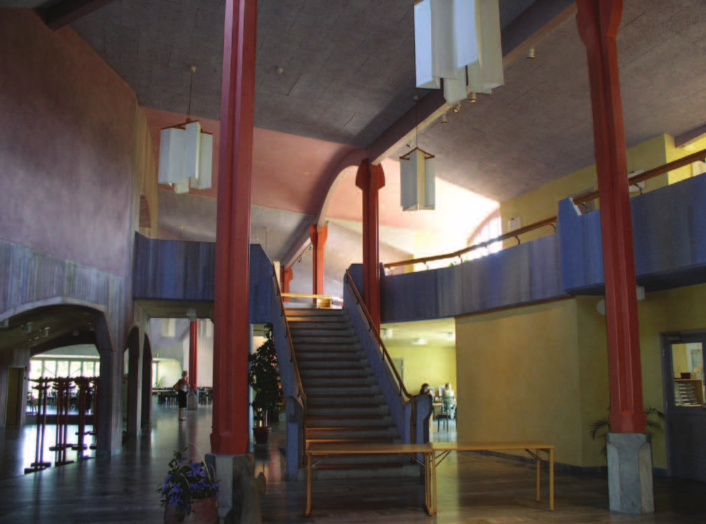
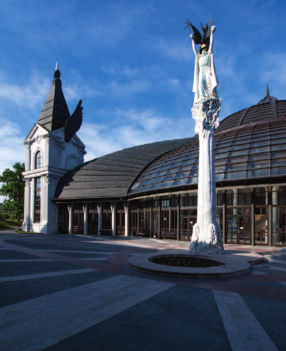
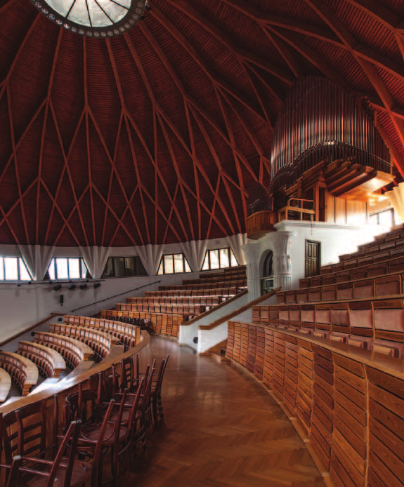
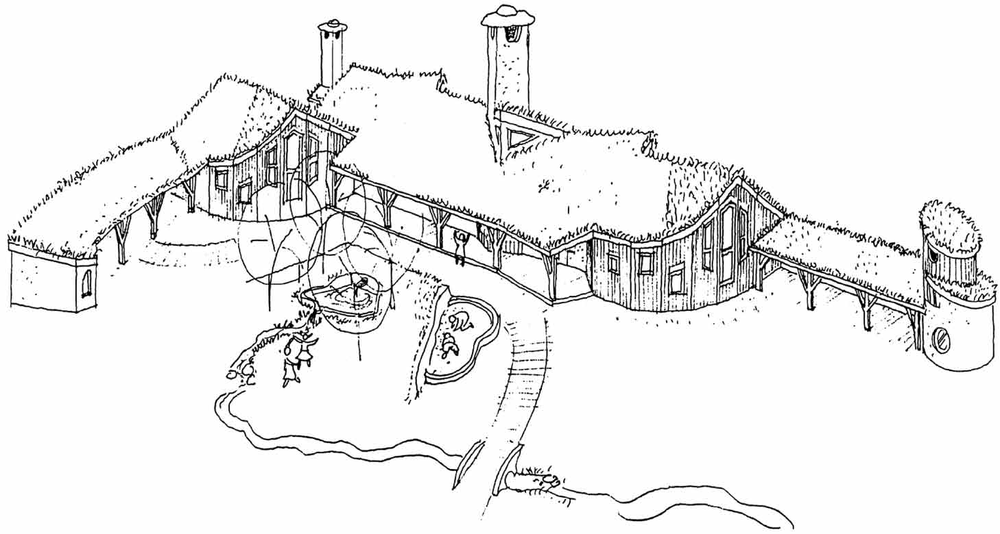
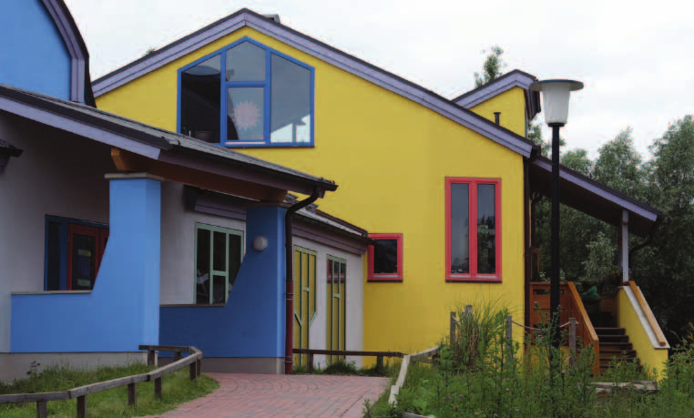
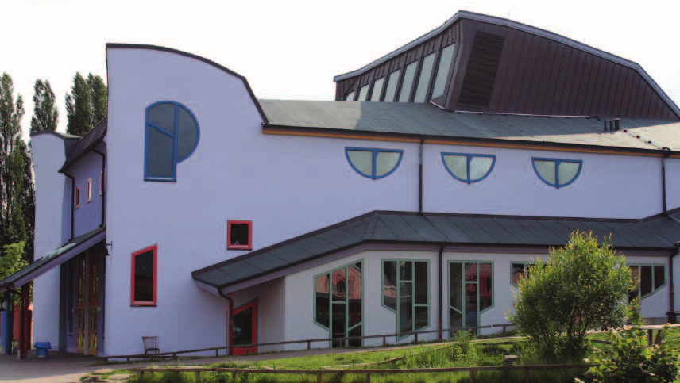
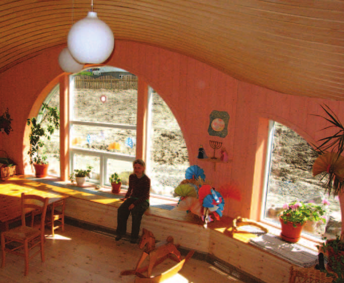
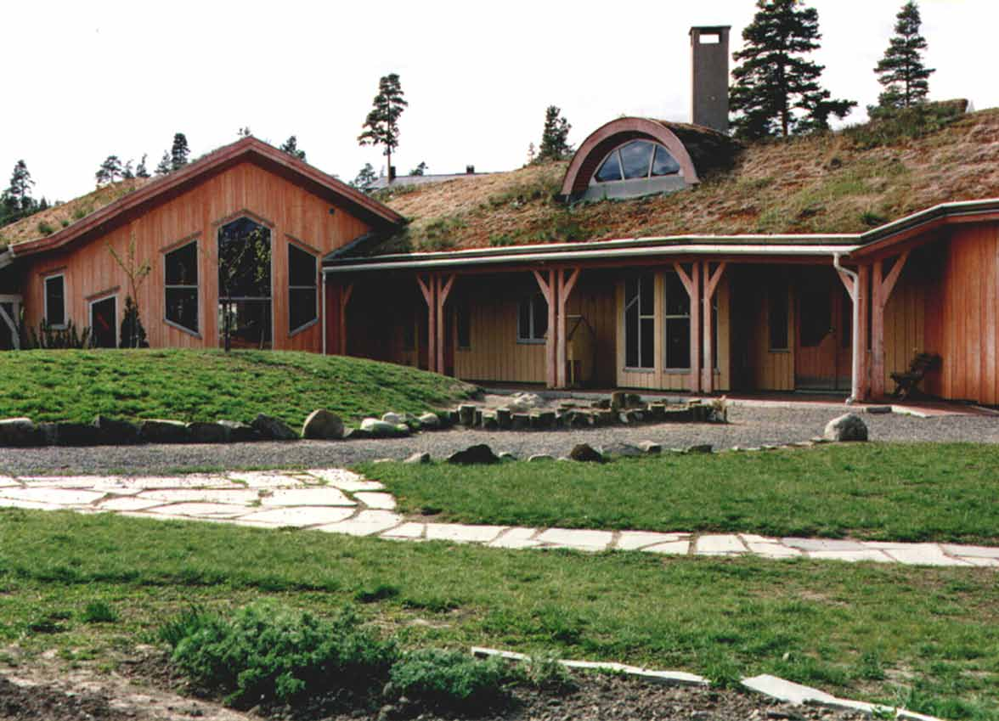

# SZÁZ ÉVE SZÜLETETT 
## ERIK ASMUSSEN ERIK ASMUSSEN (1913-1998) és MAKOVECZ IMRE (1935-2011)

_Nils Sonne-Frederiksen_

Gondolatok két organikus építész találkozásáról, akik mindketten bizonyos 
értelemben Rudolf Steiner tanítványának tekintették magukat, mégis sok 
szempontból egymás ellentétei. Ennek a figyelemre méltó polaritásnak  a 
felismerése és megértése jelenünk, és jövőnk szempontjából elengedhetetlen.

")

Makovecz Imre csak magyarul, Erik Asmussen – Abbi – pedig egy különleges,
svéddel kevert dán nyelven beszélt. Látszólag a mimikán, és a gesztusokon kívül 
nem volt egyéb, közvetlen lehetőségük a kommunikációra. Ennek ellenére számos 
fontos találkozóra és beszélgetésre került sor közöttük, amelyek jelentőségének 
felismerése, párhuzamosan épületeik üzenetének megértésével, a mi feladatunk. 
Olyanok voltak ők ketten, mint a királyok, mindegyikük saját „udvartartással” 
rendelkezett. Amit véghezvittek, az sok esetben csak az őket körülvevő emberek 
együttműködésével valósulhatott meg. Abbi és Imre találkozására én ebből a 
perspektívából tekinthetek vissza. Bizonyos személyeket megemlítek, míg másokat 
nem, mégis mindannyian tevékeny résztvevői voltunk a körülöttük folyó 
eseményeknek. Minderre azonban csak azért voltunk képesek, mert erőt  
merítettünk a környezetből, amelyben Abbi és Imre központi, mértékadó 
személyiségek voltak. Olyanok voltunk, mint két nagy család.

A stockholmi Építészeti Múzeumban 1981-ben kiállítást rendeztek Tradíció és
metafora – 9 magyar építész címmel. A bemutatott építészek között volt
Makovecz Imre és Erdei András, akik a megnyitóra is eljöttek. Stockholmtól
ötven kilométerrel délnyugatra, a järnai Rudolf Steiner Szeminárium mellett
volt Erik Asmussen építészirodája egy fából készült raktárépületben, kissé félreeső helyen, Järnafjärden közelében. Ebben az épületben működött Arne
Klinborg képzőművészeti iskolája is, a Rudolf Steiner Szeminárium egyik részlege. Nekünk, építészeknek jutott a ház egyharmada, Arne képzőművészeinek
a maradék kétharmad. Arne minden reggel eljött a hallgatókhoz, és együtt
dolgozott velük. Egyik délelőtt átjött hozzánk azzal a hírrel, hogy este 
előadást tart egy magyarországi antropozófus organikus építész Stockholmban.
Elhatároztuk, hogy elmegyünk. Ez volt az első találkozásunk Makovecz Imrével.
Imre előadásából a legnagyobb hatással egy film képei voltak rám, 
amelyben két ember, egy fekete és egy fehér, egymásba tekeredve fekszenek 
a homokban, mint Yin és Yang. Egyre fokozódó drámaiságú, mi több, véres 
történés volt, ahogy elválnak egymástól, és saját útjukat kezdik járni. 
(F. Kovács Attila: Sötétség és fény, Ozmund és Ahriman. 
17 perces kisfilm, 1979. – szerk.) Másnap Makovecz Imre és Erdei András Järnába 
látogattak. Abbi volt a társaság középpontjában, a találkozás szószólója azonban 
Arne volt. Ezen az estén csakúgy, mint az előző napon, és még sokszor az 
elkövetkezendő években, Lampel Miklós, szintén építész feleségével az 
1956-os forradalom óta Stockholmban élő magyar építész volt a tolmács. 
A kis kiállítási katalógusban olyan faépületek voltak, amelyeknél a tető és 
a fal szinte átfolytak egymásba. Ablak alig volt rajtuk, vagy csak igen 
ritkásan. Monolitikus, számunkra idegen, de erőteljes épületek voltak ezek. 
Hasonlítottak némileg Abbi épületeihez, például az Euritmia házhoz, 
melynek szintén monolitikus jelleget kölcsönzött a tető és a falak 
egybeolvadása. Kezdetben Imre maga is monolitikus tömbnek tűnt, egy földműves 
benyomását keltette. A későbbiekben természetesen ez a kép teljesen 
megváltozott. Az organikus építészet színpadára lépve Imre új hangot ütött meg. 
A néhány évvel korábban, 1978-ban, az 50 év Goetheanum – Rudolf Steiner 
építészeti impulzusai címmel megrendezett kiállításon még nem vett részt.
1985 nyarán Rex Raab feleségével, Grethével együtt Järnába látogatott. Ismét egy 
nemzetközi építész-konferenciát akart szervezni, és egyeztette Arnéval a 
felkért előadók névsorát. Társszervezőként megtudtam, hogy a meghívandók között 
van Makovecz Imre is. Stockholmban Lampel Miklóson és feleségén, Éván keresztül 
zajlottak az egyeztetések Imrével. Egyik nap felhívott Brit Kropelin, egy 
képzőművész-hallgató Oslóból. Makovecz Imréről írt tanulmányt, éppen akkor 
látogatott Järnába Gerle Jánossal. Ekkor ismertem meg Jánost, aki sokat 
mesélt nekem Imréről. Tőle hallottam, hogy Imre, miután megkapott egy megbízást, 
hosszú ideig látszólag nem csinált semmit: egyfajta meditatív munkát végzett a 
helyszínnel, belemélyedve annak történelmébe és földrajzába. Amikor ez a folyamat 
beért, rendszerint visszavonult az irodájába és bezárkózott. Kávét, cigarettát 
hozatott, és éjjelnappal, szinte átszellemült állapotban dolgozott. 
Amikor elkészült, kijött a szobájából, és kidolgozásra átadta a tervet egy fiatal 
kollégának. Képes volt rá, hogy továbbadja – a maga részét elvégezve, 
nyugodt szívvel másra bízta. Sajnos Imre nem jött el a konferenciára, 
néhány nappal érkezése előtt lemondta részvételét. Magas vérnyomása miatt orvosa 
azt tanácsolta, ne üljön repülőre. A résztvevők között érezhető volt a 
csalódottság. Ő azonban előadása anyagát több levélben, különböző címekre 
szétosztva elküldte. Maga darabolta fel számozott sorokra úgy, hogy csak egy 
kóddal lehetett azokat összefűzni és elolvasni. A vasfüggönyön túlra való 
„szellemi csempészet” ténye hozzájárult az előadás felolvasását jellemző 
különös hangulathoz. Volt egy kis improvizált kiállítás is a terveiről Lampel
Miklósék szervezésében, akik a megosztott Európában ezzel a tettükkel kiálltak
a szabad Magyarország mellett. Mindez a konferencia résztvevői közül sokak
érdeklődését felkeltette, és hosszú időre beszédtéma maradt.
Gerle János még a konferencia évében meghívott minket Budapestre. Imre 
irodájában találkoztunk a Svájcból érkezett Anthony Tischhauserrel is, aki egy 
róla készült monográfián dolgozott. Anthony kérdéseket tett fel, János 
fordított. Imre válaszolt, és közben egy nagyméretű papírra rajzolt. A vonal,
mintha csak úgy folyt volna a ceruzájából. Habozás, próbálgatás nélkül. 
Biztosan, majdhogynem automatikusan, a grafit szinte önálló életet élt. 
Ezt látva Abbira gondoltam. Neki is volt egyfajta vonalvezetése, 
amit csodáltam, de ez inkább vizsgálódó, tapogatózó volt.
Másik kezében mindig készen állt a radír. Egy idő után Imre asztalára felszelt
kenyér, paradicsom, kávé és tea került – akár egy pikniken. Az est folyamán a
beszélgetés az organikus építészetre terelődött. Imre nemtetszésének adott
hangot sok mindennel kapcsolatban, ami az antropozófus organikus 
építészet területén akkoriban tapasztalható volt. Három személyről azonban 
teljes tisztelettel szólt: Joseph Beuys, Arne Klinborg és Erik Asmussen. 
Úgy érezte, hogy ez az a kör, ahová tartozik, és amihez mérettetni akarja 
magát. Ebben az összefüggésben érthetővé, és emberivé váltak kritikus 
kijelentései, amelyek ellen – tekintettel arra, hogy a három kiválasztott közül 
egynek munkatársa voltam Järnában – nem protestálhattam. Érdekes, hogy 
Rex Raab, aki központi szerepet játszott az egész mozgalomban, és a 
generációmnak fontos tanítómestere volt, ebben az összefüggésben nem említette 
Imrét, bár már túl volt a vele való első találkozáson.
Hármójuk közül csak Erik Asmussen volt építész, ezért úgy gondoltam, hogy
elemzésem során egyedül őt állítom párhuzamba Makovecz Imrével.
Egy langyos nyárvégi estén, késői búcsúnk alkalmával megkérdeztem
Imrét, hogy beszámolhatok-e Arnénak és Abbinak a beszélgetéseinkről. Rám
pillantott, vállamra tette a kezét és azt mondta: „Jól csinálsz mindent”. Tehát,
tulajdonképpen nem adott választ a kérdésemre, de mondott valami alapvetőt: 
„Higgy magadban! Hagyd kibontakozni azt, ami benned él, az lesz a helyes út!” 
Ez lenne a mester tanácsa a beavatás útján? Ebben a helyzetben számomra ez egy meghatározó kijelentés volt.
Abbira gondoltam, és az ő merőben ellentétes felfogására. Egész életében
a kétkedés volt a vezérelve. Nem csupán akkor volt nála a radír, amikor rajzolt.
Egy hintaszék is tartozott a felszereléséhez, amit akkor kapott meg tőlünk,
amikor maga is túl sokat beszélt róla, mintegy ezáltal érdemelve ki a jutalmat.
Előredőlt, az asztal fölé hajolt, és rajzolt. Aztán hátralendült, hogy 
eltávolodjon, és ítéletet alkothasson. Aztán megint előre dőlt, hogy ismét 
aktívan nekifogjon. A számtalanszor megismételt kétkedő ítélkezés újabb és 
újabb változatokat hívott életre.
A következő napok folyamán Jánossal és Antonyval hármasban megtekintettünk 
néhány Makovecz-épületet. Ekkor merült föl bennünk a gondolat, hogy a következő 
évben Magyarországon szervezzük meg a nemzetközi vándorkonferenciát. 
(Nemzetközi antropozófus vándorkonferencia – szerk.) A döntéssel, majd a 
konferencia előkészítésével új fejezet kezdődött a két ellentétes felfogású 
építész, illetve irodáik közötti kapcsolatban. Egy vasfüggönyön túlnyúló 
szabad kezdeményezésről volt szó. Az, hogy Magyarország néhány évvel később 
kulcsszerepet játszik majd a berlini fal leomlásában, akkoriban meg sem fordult 
a fejünkben, esetleg csak magyar barátaink fejében. Lelkesített a gondolat, hogy
az adott helyzetben minden tőlünk telhetőt megteszünk. Éreztük, hogy ez egy 
olyan lehetőség, amit meg kell ragadnunk, ez fűtötte találkozásainkat.

")

Termékeny találkozás volt ez, néhány nehéz helyzettel tarkítva. Talán az volt a 
tudat alatt Stockholmban kezdődött minden, amikor Imre bemutatta filmjét a 
fekete és fehér alakokkal, akik mint Yin és Yang egymásba tekeredve 
feküdtek… Talán ami ebben filmben feloldódott és széthullott, ahogy sok 
tekintetben a körülöttünk levő világban is, az ösztönzött minket arra, hogy 
hátra arcot csináljunk, és az összetartozó ellentmondásokat egy felszabadult 
találkozás alkalmával, ünnepi keretek között, újra egyesítsük.
Találkozásaik alkalmával, újra és újra felszínre törtek az apró részletekben
rejlő különbségek és ellentétek. Ugyanakkor mindent áthatott egy erős összhang 
és az összetartozás érzése.
Imre egy korán megkezdett, meredeken felfelé ívelő karriert tudhatott maga 
mögött. Ezzel szemben Abbi meglehetősen későn, ötven évesen tudott irodát 
alapítani, és önálló projektekbe kezdeni. Imre építményei a föld felé forduló 
hallgatózó nagy fülekre emlékeztetnek, amelyekkel meghalljuk, mi történt az 
adott helyen a múltban. Abbi épületei inkább a nap fele, a jövőbe tekintő 
szemek, amelyeknél fontos az ablakokon beáramló fény, amint a lazúr színeit 
életre kelti a térben. Két feltételt szabtak. Imre kívánsága az volt, hogy 
hozzunk magunkkal egy kiállításra való anyagot Abbi épületeiről, s ő tartson 
egy nyilvános előadást a budapesti építész szövetség (Magyar Építőművészek 
Szövetsége, szerk.) épületében tartott megnyitón. A találkozás egyben komoly 
bemutatkozás kellett hogy legyen. A katalógust Budapesten két nyelvre, angolra 
és magyarra fordították. Az anyag átadására akkor adódott lehetőség, amikor 
Imre lánya és veje, útban Finnországból Budapestre, elhaladtak az autópályán 
Järna mellett. Egyeztettük a helyszínt és az időpontot, átadtuk a „szent 
dokumentumot”, amit ők Budapestre „csempésztek”. Magát a kiállítást pedig 
bepakoltuk egy kisbuszba, és a megfelelő vámpapírokkal ellátva átszállítottuk 
egész Európán. Jan Arve Andersen, Åke Fant és jómagam indultunk el a busszal, 
majd építettük fel a kiállítást Budapesten. Az utazáshoz a szállást és az 
ellátást Järnából szervezték meg. Meghívókat küldtek szét, és itt gyűjtötték 
be a jelentkezéseket. Az eleinte 75 főre becsült társaság tagjai Bécsben 
találkoztak, ahonnan 1987. augusztus 9-én egy bérelt emeletes busz szállította 
őket tovább a nyugat-magyarországi Velem felé. Később kiderült, hogy a 
résztvevők száma valójában ennek a duplája. A hét folyamán egy különböző 
járművekből – kisbuszokból, Trabikból, nem csupán Magyarországról, hanem az 
akkori NDK-ból, Lengyelországból, Csehszlovákiából, Romániából, Jugoszláviából 
–, álló konvoj alakult ki mögöttünk jelentős számú résztvevővel, akiknek az 
ellátásáról és szállásáról Järnából nem gondoskodtunk, nálunk ugyanis nem 
jelentkeztek be. A megugrott létszám már az első este kínossá vált, nem volt
szállása még Jánosnak sem, aki tolmácsként (és szervezőként szerk.) 
egyértelműen a legfontosabb személy volt a csoportban. Nem egyeztettük. Érthetetlen, hogyan történhetett ez. Még ma is elvörösödöm a szégyentől, ha erre 
gondolok. Imréről sem gondoskodtunk. A nyelvet nem beszéltük, mobiltelefon
még nem létezett. Le kellett hát győzzük szégyenérzetünket, ahogy ezt a magyarok 
tették félénkségükkel és szerénységükkel. Vajon ez is egyfajta ellentét volt, 
amivel meg kellett ismerkednünk? Páran hol feltűntek, hol eltűntek, talán 
hazajártak aludni Budapestre. A találkozás Imre Magyarországon megépült 
munkáival, a hagyományos mestermunka, a kultúrházak körüli helyi társadalmi és 
politikai viszonyok, a fantasztikus faszerkezetek, az a tény, hogy mindehhez 
olyan kevés modellt építettek (Asmussen irodájának tervezői metódusában a 
modellezés, 1:500-tól haladva az 1:1-ig, alapvető munkamódszer – szerk.), az 
erőteljes megformálás stb. nagy hatással voltak ránk. Különösnek találtuk, hogy 
Abbi és Imre, akiknek oly sok kapcsolódási pontjuk van az antropozófiában, 
végül ennyire különböző eredményre jutottak.

A harmadik napon érkeztünk Budapestre, Abbi kiállításának esti megnyitójára. 
A terem zsúfolásig megtelt. Abbi rendkívül izgatott volt. Hónapokon át dolgozott 
előadásán. Amire csak akkor vállalkozott, ha végképp elkerülhetetlen volt, 
most rákényszerült. Ezért, hogy előadása ne tűnjön túl rövidnek, dánul tartotta 
(hiszen Imre is csak magyarul beszélt), és ezt kellett aztán angolra és magyarra 
fordítani. Abbi dán facipőben lépett a terem közepén álló szónoki emelvényre, 
kezében papírtekercsével, ami aztán szép lassan gördült le. Olyan volt, mint 
Caesar a harci szekerén, készen a nagy versenyre, vagy mintha a Szenátus előtt 
kellene megvédenie magát, és ehhez készítette volna elő szónoklatát. Végül is, 
túlesett rajta, aztán jött az ünnepi fogadás a nagyteremben, Imre beszéde, a 
pezsgő és a büfé. Imre egy nagy lépcsőn vezette Abbit a vendégek elé, emlékszem,
ahogy ott állt Abbi a facipőjében, kissé bátortalanul. (A kiállítást a MÉSZ 
székház nagytermében rendezték meg – szerk.) Mindeközben lejátszódott egy másik
drámai esemény. A kiállítás már látható volt néhány napja, de mi még nem
láttuk a katalógusokat. Azokat a kiállítótér mögötti folyosókon, lépcsőkön
osztogatták. Ott volt Turi Attila és Steen Kristiansen. Először csalódottak 
voltunk az eredmény láttán. A borítólapot Abbi telerajzolta különböző 
házmotívumokkal. A nyomtatáskor ezt lekicsinyítették, így a rajzoknak lett 
egy fekete keretük. Aminek eredetileg egy a szellemi világba áthatoló, táguló, 
exkarnációszerű vonalszövevénynek kellett volna lennie, azt egy magába 
inkarnálódó motívumhalmazként interpretálták, piktogramszerűen, fekete keretbe 
foglalva. Két különböző gondolkodásmód állt egymással szemben. El sem hinné az 
ember, hogy mennyire különböző és ellentétes törekvések létezhetnek. Sokkhatás 
alá kerültünk. Valószínűleg mindkét fél ugyanezt érezte, mert mindenkit a 
jószándék vezérelt. Olyan találkozás volt ez, ami csak évekkel, évtizedekkel
később hozta meg gyümölcsét, egy megvilágosító felismerés formájában.

")

Kik voltunk mi? Ki volt Abbi és ki volt Imre? Kik vagyunk mi, akik 
kettejükkel egy úton járhattunk? Az utazás folytatódott. Imre nem magyarázta a 
házait. Magával vitt minket, és hagyta, hogy részeivé váljunk a megbízóihoz 
fűződő baráti kapcsolatainak. A béke helyszíneire érkeztünk. Sokat beszélgettünk. 
Írtunk egy felhívást annak a hivatalnak, amelyik nem a tervezői szemléletnek 
megfelelően kezelt egy építkezést. Lars Danielsson fogalmazta meg a levelet és 
mindannyian aláírtuk. Visegrádon megtapasztalhattuk a minden évben megtartott 
tábor (Visegrádi építésztáborok 1981-2001 – szerk.) és a gyakorlás erejének 
lenyűgöző hatását. Järnában a nemzetközi építészkonferenciák és a szokásos 
szemináriumok alakították a miliőt. Visegrádon olyan munka- és oktatási 
módszerrel találkoztunk, amely nagy benyomást tett ránk: fiatal építészek, 
akik akartak valamit, és közöttük egy mester, aki merészelt is elvárni valamit 
ezektől a fiatalemberektől. Järnában ez nem volt ilyen egyértelmű. Hozzánk 
Norvégiából, Finnországból, Dániából, Angliából, Németországból jöttek oktatók. 
Nem csupán építészek, hanem kertészek és mezőgazdászok, euritmia tanárok, 
pedagógusok, zenészek és festők is. Itt, Visegrádon, a koncentrált sűrűség hatott 
ránk. Irigylésre méltó volt mindez, s egyben jóérzéssel töltött el minket. 
Peter Rix felvetette (vajon milyen nyelven?) a nemzetközi mesteriskola megteremtésének kérdését, amire Imre rögtön felfigyelt. Peter Németországban több 
neves építésznél propagálta ezt az ötletet, sajnos sikertelenül. Järnába 
hazaérve javasoltam, küldjünk meghívót a Makonának, különben semmi nem lesz 
ebből a szép gondolatból. Imre mindeközben igazi vándoriskolát teremtett a 
„fiúkkal” Magyarországon, fokozva a visegrádi tábor impulzusait. Visegrádról 
visszautaztunk Bécsbe, a vándorkonferencia véget ért. A kiállítás, amelynek 
ötletét Imrének köszönhettük, később eljutott Stuttgartba, Bécsbe, Kielbe, 
Düsseldorfba, Veljébe, Helsinkibe, Koppenhágába és Moszkvába. A meghívást, 
amely lehetővé tette, hogy a Makona építésziroda egy tagja néhány hónapot 
dolgozhasson Asmussen irodájában, szerencsére elfogadták. Három ízben történt 
munkatárscsere, elsőként Kravár Ágnes érkezett (1988-ban – szerk.) 
Budapestről, majd Tommy Nordlander ment Stockholmból Budapestre (1989), végül 
Salamin Ferenc jött (1990) Budapestről Järnába. (1989 és 1995 között a 
Makona Építésziroda több mint húsz külföldi – svéd, német, francia, holland, 
belga, ír, felvidéki, erdélyi, olasz, angol – építészt fogadott a program 
keretében, a szerk.) Tommy gyakorlata a Makonánál olyan drámai fordulatot vett, 
amely majdnem ott tartózkodásának megszakításához vezetett. A konfliktus 
ellenére, amelyet csak a két mester között fennálló polaritás szemszögéből 
lehet megérteni, ez a csereprogram egy újabb, sikeres kapcsolódási pontot 
jelentett a két mester között. Imre nem volt elégedett Tommy viselkedésével, 
aki rendkívüli kihívással került szembe, és közel volt ahhoz, hogy feladja. 
Abbit alig vonták be az ügybe. Steen kezdeményezte, hogy Tommyt Magyarországra
küldjék, bár az egész előtörténetnek nem volt részese, és teljesen 
felkészületlenül érkezett Budapestre. Nem volt felkészülve sem Imre 
építészetére, sem pedig munkamódszerére. Imre meg volt döbbenve, és irritálta a 
helyzet. Ágnes telefonált Järnába és vázolta a szituációt, én pedig a 
lehetőségekhez mérten próbáltam békítő szavakat találni Tommy viselkedésére.
Végül mindenki számára jó tapasztalatokkal zárult az ügy. Hazatérve Tommy
egy olyan tervet tudott felmutatni, amilyet előtte még nem láttunk tőle: a
paksi templomtorony szerkezeti rajzát. Büszkék voltunk rá! Tommy egy 
értekezésben foglalta össze tapasztalatait, melyet Imre 1990-es stockholmi 
kiállítási katalógusához állított össze. Ágnes és Ferenc nagyon ügyesek és 
önállóak voltak. Nem tudtuk őket teljes mértékben leterhelni tervezési 
feladatokkal, mivel azok volumene nálunk a magyarországiak töredéke volt. 
Otthon keményebb munkához szoktak, így itt inkább a játékos feladatokra és a 
kirándulásokra helyeztük a hangsúlyt. Ágnest felkértük, hogy mutassa be 
grafikusan Magyarország történetét egy A4-es lapon. Látva, hogy milyen 
könnyedén fogott hozzá, fel kellett tennünk magunknak a kérdést: vajon mi is 
ki tudtuk volna fejezni ilyen részletgazdagon és ilyen lélekjelenléttel a saját 
nemzetünk történelmét? Ágnes nem csak az építészethez értett… Abbi ugyanabban a 
teremben dolgozott, ahol mi – nem vonult félre egyedül.
Egész nap az asztalánál ült, ha kérdésünk volt, odamehettünk, és megmutattuk 
neki a rajzunkat. Kritikáját nem tudta szabatosan és közvetlenül kifejezésre 
juttatni. Helyette közvetett módon, grimaszokkal, humorosan adta tudtunkra 
véleményét. Ennek ellenére hatni tudott ránk a ki nem mondott dolgokkal is. 
Nem könnyű egy idegent beavatni az ilyenfajta munkába. Az, hogy valakit 
felvesznék-e az irodájába, mindig egyedileg dőlt el, nem volt két egyforma eset. 
Természetesen mindig akadt jelentkező, aki szívesen dolgozott volna nála. 
Voltak, akik a hosszabb ideig tartó ostrom ellenére végül kudarcot vallottak, 
mások teljesen váratlanul kerültek ide, és mégis egy évet maradtak. Imrénél a 
munka másképp zajlott. Egyszer azt mondta nekem: „Hagyd kibontakozni azt, ami 
benned él, az lesz a helyes út!” Abbi ugyanebben a helyzetben azt tanácsolta 
volna: „…ha kételkedsz a munkád minőségében, attól az csak jobb lehet. Készíts 
modellt, ítéld meg kritikus szemmel, mielőtt egy még jobbat csinálsz”.
Nagy hatással volt ránk Imre ékesszólása. Szövegeit svédre fordíttattuk és
kezdeményeztük, hogy a Balder folyóirat azokból egy különszámot adjon ki.
Abbi szűkszavú volt. Nem szívesen beszélt nagyobb társaság előtt, keveset
írt, és nem is egészen helyesen. Úgy tűnt, mintha minden erejét a rajzaiba
adná bele, amelyek szinte pezsegtek a szellemességtől és életerőtől. Az Abbi
körül uralkodó állandó jókedvet dán származásának tudták be. Valójában ez

többek között annak volt köszönhető, hogy olyan hivatásnak szentelte magát,
amihez igazán tehetsége volt. Elemében érezte magát. Az egyéb kvalitásokért 
mások feleltek. Így Arne Klingborg beszélt Abbi helyett. Szóvivő volt, az
antropozófia ügyvédje. Mindenki hozzá fordult tanácsért, s ő mindenről tudott, 
ami az antropozófia körül zajlott. Ami a Järnában szerzett építészeti
impulzusokat illeti, érdekes módon három személyiség állt itt egymás mellett, egy ritka funkcionális viszonylatban. Arne volt az illetékes a 
kommunikációban: a szavakért és gondolatokért felelt. Abbi építészként az érzéki 
észlelések mestere volt, a tervek formai megvalósításáért és azok művészi 
kidolgozásáért felelt, ami nála egyfajta átérzés eredménye volt. Åke Kumlander 
volt a cselekvő. Nemcsak a pénzt hozta össze, hanem a kivitelezőket, a 
mestereket és az építőanyagot is. Hármójuk közül ő képviselte az akaratot. 
Nélküle Järnában nem épülhetett volna meg semmi. Hárman egy, az építés 
szolgálatában álló organizmust alkottak. Ennek a hármas tagozódásnak az 
erejével a szellemi képességek, mint a gondolkodás, érzés és akarás, bizonyos 
mértékben egymástól elválasztva, a tökéletesség irányában igazzá, széppé és jóvá 
tudtak alakulni. Nem bajtársi kapcsolat volt ez, hanem karmikus. Aki ezt 
megtapasztalta, érezhette, hogy ez a konstelláció valami jövőbelit mutatott fel, 
és áldásos sikerrel járt. Visszafogottan ugyan, de ez az együttállás már a 
budapesti kiállításon készült egyik fotón is jól kivehető, amelyen mindhárman 
láthatók – Arne, rá jellemző módon, éppen beszél és gesztikulál.
Ebből a szempontból Imre minden szükséges tulajdonsággal rendelkező mester volt, 
ma már nagyon ritka, Abbit messze túlszárnyaló szuverenitással.
Olyan jelenség volt, amilyet csak a régmúlt időkből ismerünk. Hálásak lehetünk 
a sorsnak, hogy találkozhattunk vele. Olyan mércét állított, amelyet lehetőség 
szerint tovább kell adnunk. Ők ketten, Abbi és Imre együtt Yin és Yang, a 
teljesség kifejezői. Abbi a térprogramból kiindulva dolgozott, a felületeket 
papírból kivágta és felragasztotta. Készített egy skiccet, aztán megszámozta 
a lapot és félretette. Aztán újra elölről kezdte, egy jobb funkcióanalízissel, 
ez volt a második lap – ezt is félretette. A növényekhez hasonlóan, a szára 
mentén, alulról felfelé haladva bontotta ki leveleit, egyiket a másik után. 
Nyomon lehetett követni, miként lesz a terv először tartalmasabb, komplexebb, 
aztán egyszerűbb, hogy aztán végül poétikusabbá váljon, megszabadulva a 
hétköznapi terhektől. Mint egy tavaszi virág, ami egyre növekszik, hogy végül 
kiontsa illatát. Imre először beleképzelte magát a motívumok szférájába, innen 
szárnyakat kapva, szinte lángra lobbanva vetette papírra a jeleket. Mint a 
gyümölcstermő, maghozó őszi természet. Ellentétes irányú munkafolyamatok ezek. 
Abbi alulról haladt felfelé, mint a természet tavasszal, a materiális funkciótól 
a poézis, a szellemi felé. Imre felülről lefelé haladt, a motívumok spirituális 
világából a földi szerkezetek és anyagok felé. Együtt mindez nem más, mint 
párbeszéd ég és föld, anyag és szellem között.
A végére hagytam egy kis anekdotát. Sokat utaztunk együtt Abbival, egész
Németországon át, legtöbbször vonattal. Egyszer erős vihar volt, fák dőltek ki,
folytak az eltakarítási munkálatok. Az elsuhanó vonatból látottak alapján
Abbi rajzsorozatot készített, amit aztán egy mosoly kíséretében átnyújtott nekem. A rajzok magukért beszéltek: egy lefűrészelt lombkorona fejjel lefelé
fekszik a földön, majd beborítják egy sátorhuzattal, és megtámasztják egy
másik kidőlt fával. A csonka fatörzs, ami felül kikukucskál, kémény lesz. 
A sátor bejáratából két láb nyúlik ki, a cipőorrok lefelé néznek. Kint már van 
egy babakocsi. Egy gólya repül arra. Teljes gőzzel folyik a betelepülés…
Ezt az anekdotát Abbi igenlő hozzájárulásának tekintem teóriámhoz, amit
Imrével való poláris viszonyáról ezennel közreadtam.

_Sipos Barna fordítása, lektorálta: Móra Zoltán_

ERIK ASMUSSEN – BORN 100 YEARS AGO Erik Asmussen (1913-1998) and 
Imre Makovecz (1935-2011) Notes by Nils Sonne-Frederiksen Erik Asmussen, 
also known to us as Abbi, and Imre Makovecz are organic architects, both from 
the school of Rudolf Steiner. Yet they are opposites in so many senses of the 
word. Recognizing and understanding this remarkable polarity may have great 
significance for the present and the future. The author documents all the 
important moments in their relationship, starting from its very beginning in 
1981, such as conferences, exhibitions and the exchange program between the two 
architectural offices, and presents a vivid picture of the oppositions inherent 
in their personality and way of working. “Abbi starts from below and reaches 
upward like nature in spring, from the material to the spiritual and poetic 
functions, while Imre approaches from above and moves downward, applying the 
motifs of the spiritual world to earthly structures and materials. Their 
collaboration forms a dialog between heaven and earth, spirit and matter.”

")

# NIELS SONNE-FREDERIKSEN

1946-ban született Dániában. Tanulmányait a Koppenhágai Művészeti
Akadémián végezte • 1979-1993 Erik Asmussen építésziroda, Järna; munkatárs, majd vezető tervező • 1993 Hannoverben önálló irodát alapít Maria
Sonne-Frederiksennel • 1976–79 • színtervezési és lazúrozási munkák Fritz
Fuchs mellett, Järna • A Färgbygge cég társalapítója • Flowform-projektek
John Wilkes szobrásszal • 1977–1978 Emerson College, Nagy-Britannia

Attól a pillanattól kezdve, hogy a gyermek megfogan, kilenc hónapig egy szűk,
számára nagyon kényelmes térben él. Világrajövetele után is olyan helyzetben
érzi magát legkényelmesebben, amilyenben ott bent volt. Mintha mindenkit emlékeztetni akarna: Ne feledjétek, honnan jöttem! Az építészetben 
anyaméhnek nevezzük azokat a tereket, amelyek ezt az érzést váltják ki. Makovecz
Imre annak idején ezt nevezte „minimális személyes térnek”, aminek a 
szellemében számos érdekes arculatú épületet hozott létre. A család különösen 
fontos a gyermek életében: fedelet és otthont ad neki, s olyan támogató teret, 
amelyben elrejtőzhet a problémák elől. A család a társadalmi struktúra egyik 
pólusa, s az anyaméh az ennek megfelelő építészeti alakzat. A közösség olyan 
központja ez, mint a fának a törzse. A fa ágainak és leveleinek megfelelő 
további részek azok a funkcionális terek, amelyek a jövőbe vezetnek; arra 
késztetik az embert, hogy létrehozzon valamit, egy ács- vagy kovácsműhely, 
vagy színház például. Ezek a terek inspirálnak tevékenységre, lehetőséget 
adnak valami saját, személyes létrehozására, az új közösségi struktúra sejtjének betöltésére. Az életben az ember az „anyaméhtől” a funkcionális terek 
irányába mozog; a két véglet közötti térben nő fel: kisgyermekekből iskolások, 
majd egy nagyobb közösség tagjai leszünk. Mindezt feltétlenül figyelembe kell 
venni, amikor gyermekek számára tervezünk intézményeket. Nem az anyagi 
nyereség a fontos, hanem az ötlet, a szépség, a változás pozitív értékelése. 
Gondoljunk csak bele: életünk során mindannyian háromszor kezdjük el az iskolát. 
Először gyermekként, aki számára az iskola teljesen új élmény. Másodszor, amikor
már felnőnek a saját gyermekeink. Felköltjük őket reggel, reggelit készítünk
nekik, elvisszük őket az iskolába. Hogy a gyerekeink kényelmesen érezzék magukat az intézményben, alkalmazkodnunk kell a tanárok elvárásaihoz, segítenünk 
kell a problémák megoldásában. A gyerekeknek látniuk kell, hogy a szülők 
örömmel megtesznek minden tőlük telhetőt. Harmadjára az unokáinkkal járunk 
iskolába. Különleges szeretettel és odafigyeléssel tesszük ezt mindnyájan, 
ami rendkívül sokat jelent számukra is. Az iskola összekötő kapocsként
szolgál a család és egy hatalmas közösség, a társadalom között. Az iskola a
társadalom szíve, amelynek szintén fejlődnie kell. Éppen ezért az iskolákat
hatalmas szeretettel kell megépíteni.

_Részlet Olga Gladush interjújából, Gaál Xénia fordítása. 
A fotókat az építész bocsátotta rendelkezésünkre._

Danish architect Niels Sonne-Frederiksen started his career in the architectural
office of Eric Asmussen in Järna. Among others, he was the leading designer in
a series of projects aimed at building schools and nurseries, gaining him a 
reputation in designing educational institutions. His architectural credo was influenced by Asmussen, Imre Makovecz and Rudolf Steiner.
